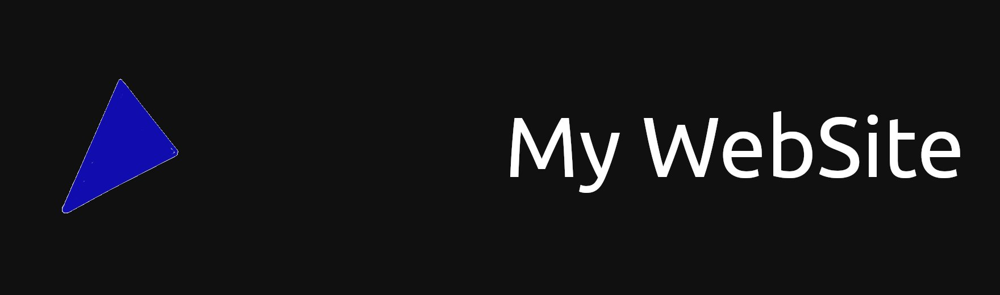

<h1 align="center">My GitHub Pages WebSite</h1>

  
  
  
  
  
  
   
  
  

<h2 align="center">Material Design</h2>
                                                                                                                       

The <a href="https://github.com/googlefonts/roboto">Roboto Font</a> by <a href="https://github.com/googlefonts/">Google Fonts</a> and the <a href="https://github.com/google/material-design-icons">Material Icons</a> by <a href="https://github.com/google/">Google</a> are Licensed under the <a href="http://www.apache.org/licenses/LICENSE-2.0">Apache 2.0 License.

<h2 align="center">Node Modules</h2>

<a href="https://github.com/microsoft/TypeScript/">TypeScript Language</a> by <a href="https://github.com/microsoft/">Microsoft</a> are Licensed under the <a href="http://www.apache.org/licenses/LICENSE-2.0">Apache 2.0 License</a>.

